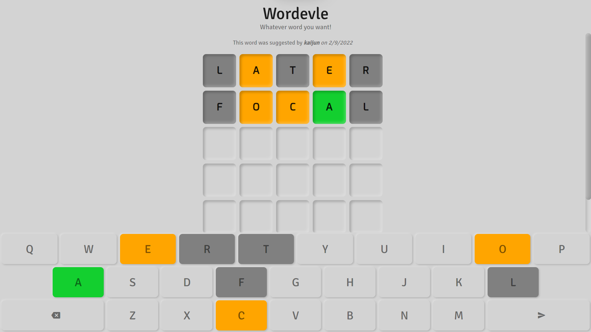
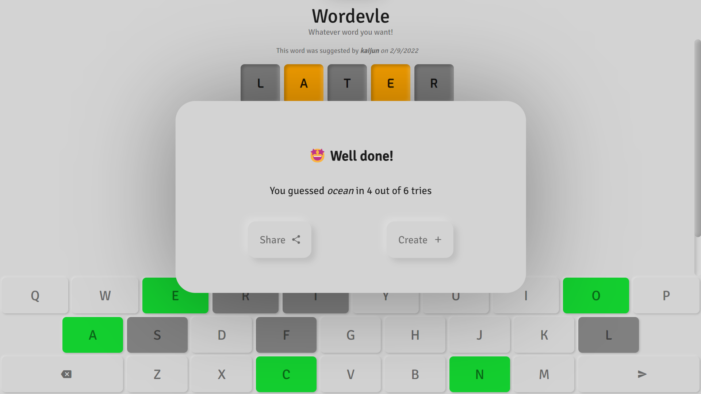
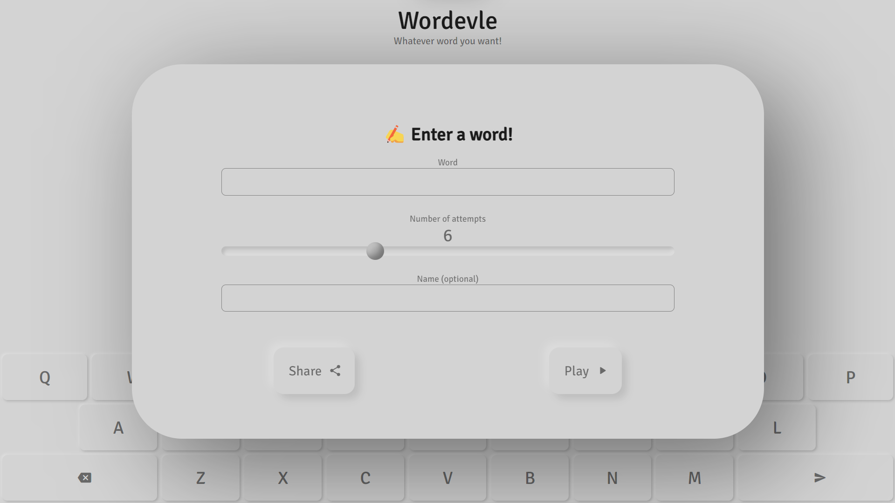

<h1 align="center">

Play [Wordevle](https://nujiak.github.io/wordevle)

</h1>

Wordevle is an English word-guessing game based on the popular game [Wordle](https://en.wikipedia.org/wiki/Wordle). Similar to Wordle, Wordevle lets you guess words and share your results with your friends. However, Wordevle lets you choose an words to challenge your friends. 

In other words, Wordevle is Wordle with *whatever* words you want. 

## Game

Wordevle uses the same game mechanics as Wordle. You are given a word and you get multiple tries to get it right.

Every attemp at guessing must be a valid English word in the dictionary. After keying in a guess, the characters are highlighted as such:

| Colour | Meaning |
| ------ | ------- |
| Grey   | The character is not in the word |
| Yellow | The character is in the word, but in a different spot |
| Green  | The character is in the word and in the correct spot |

The keyboard tiles are also lit accordingly to guide you in writing the next guess. 

The game is over when you guess the word correctly (all green) or if you use up all attempts. 

After the game is over, you have the option to share your result or suggest a word to challenge your friends.

### Sharing

Wordevle lets you share your results without revealing the word. This is an example of the shared message:

> Wordevle 4/6 ✅  
> ⬜️🟨⬜️🟨⬜️  
> ⬜️🟨🟨🟩⬜️  
> ⬜️🟩🟨🟨🟨  
> 🟩🟩🟩🟩🟩  
>
> Challenge my score on Wordevle:
>
> https://wordevle.nujiak.com/?U2FsdGVkX19+OQiOI+PCoc48VbNvU+GbmCwx42NBPKNc3nMQ4+v/x6ec8fhM2yranxIBKWxpfBdAHfmYfnTKQA==

### Creating

Instead of a daily word, you can choose any words to challenge your friends. The options available are explained in [Options](#options)

## Options

Wordevle lets you suggest words to challenge your friends. In addition, you can customise the challenge with a few options.

### Word

You can select any valid English word from the dictionary. This excludes proper nouns like common names (e.g. David is not valid).

### Number of attempts

You can choose the number of attempts that can be made to guess the word. The default number is 6. You are recommended to allow more attempts for very short or very long words.

### Name

You can optionally put in your name (or any identifier) so that players know who suggested the word.

## Technical

This section details the technical aspects of the application. 

### Tech Stack

Wordevle is written using HTML, CSS, Typescript, and Node.js. 

#### Deployment

The followign steps are taken to prepare the files for deploying as a website:
1. Typescript files (`.ts`) are transpiled to Javascript files (`.js`) using [`tsc`](https://www.npmjs.com/package/tsc).
2. Javascript files are bundled using [Browserify](https://browserify.org/) to allow Node.js modules to be used when deployed.

#### GitHub Pages

Wordevle is hosted on [GitHub Pages](https://pages.github.com/). The above steps are automated using [Github Actions](https://github.com/features/actions) when commits are pushed to the repo. The workflow can be found in `/.github/workflows/build_page.yml`. The page is deployed on a separate `pages` branch. 
